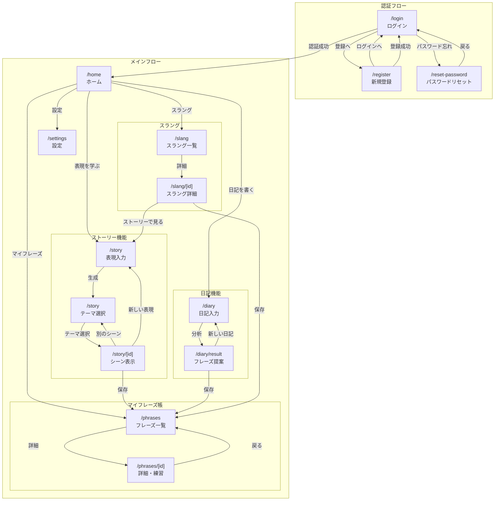

# 画面遷移図 & UI/UXガイドライン

## 12. 画面遷移図



---

## 13. UI/UXガイドライン

### 13.1 デザインシステム

#### カラーパレット
```css
:root {
  /* Primary */
  --primary-50: #eef2ff;
  --primary-100: #e0e7ff;
  --primary-500: #6366f1;
  --primary-600: #4f46e5;
  --primary-700: #4338ca;
  
  /* Secondary (感情・温かみ) */
  --secondary-50: #fdf4ff;
  --secondary-500: #d946ef;
  --secondary-600: #c026d3;
  
  /* Neutral */
  --gray-50: #f9fafb;
  --gray-100: #f3f4f6;
  --gray-200: #e5e7eb;
  --gray-300: #d1d5db;
  --gray-500: #6b7280;
  --gray-700: #374151;
  --gray-800: #1f2937;
  --gray-900: #111827;
  
  /* Semantic */
  --success: #10b981;
  --warning: #f59e0b;
  --error: #ef4444;
  --info: #3b82f6;
  
  /* Dark Mode */
  --dark-bg: #0f172a;
  --dark-surface: #1e293b;
  --dark-border: #334155;
}
```

#### タイポグラフィ
```css
:root {
  --font-sans: 'Inter', 'Noto Sans JP', sans-serif;
  --font-serif: 'Merriweather', 'Noto Serif JP', serif;
  
  /* サイズスケール */
  --text-xs: 0.75rem;    /* 12px */
  --text-sm: 0.875rem;   /* 14px */
  --text-base: 1rem;     /* 16px */
  --text-lg: 1.125rem;   /* 18px */
  --text-xl: 1.25rem;    /* 20px */
  --text-2xl: 1.5rem;    /* 24px */
  --text-3xl: 1.875rem;  /* 30px */
  --text-4xl: 2.25rem;   /* 36px */
}
```

#### スペーシング
```css
:root {
  --space-1: 0.25rem;  /* 4px */
  --space-2: 0.5rem;   /* 8px */
  --space-3: 0.75rem;  /* 12px */
  --space-4: 1rem;     /* 16px */
  --space-5: 1.25rem;  /* 20px */
  --space-6: 1.5rem;   /* 24px */
  --space-8: 2rem;     /* 32px */
  --space-10: 2.5rem;  /* 40px */
  --space-12: 3rem;    /* 48px */
}
```

### 13.2 コンポーネント仕様

#### Button
| バリアント | 用途 |
|-----------|------|
| primary | 主要アクション（保存、送信） |
| secondary | 副次アクション |
| ghost | テキストリンク的ボタン |
| destructive | 削除など危険なアクション |

```tsx
// サイズ
size: 'sm' | 'md' | 'lg'
// sm: h-8 px-3 text-sm
// md: h-10 px-4 text-base
// lg: h-12 px-6 text-lg
```

#### Card
```tsx
// 基本カード
<Card>
  <CardHeader>
    <CardTitle>タイトル</CardTitle>
    <CardDescription>説明</CardDescription>
  </CardHeader>
  <CardContent>コンテンツ</CardContent>
  <CardFooter>フッター</CardFooter>
</Card>
```

#### Badge（タグ・ステータス表示）
| バリアント | 用途 |
|-----------|------|
| default | 通常タグ |
| emotion | 感情タグ（暖色系） |
| tone | トーンタグ（寒色系） |
| risk-safe | 安全なスラング |
| risk-careful | 注意が必要 |
| risk-avoid | 避けるべき |

#### Input / Textarea
- ラベル上部配置
- エラー時は赤ボーダー + エラーメッセージ
- フォーカス時: ring-2 ring-primary-500

### 13.3 アニメーション

#### トランジション
```css
/* 基本 */
transition: all 150ms ease;

/* カード・モーダル */
transition: all 200ms cubic-bezier(0.4, 0, 0.2, 1);

/* ページ遷移 */
@keyframes fadeIn {
  from { opacity: 0; transform: translateY(10px); }
  to { opacity: 1; transform: translateY(0); }
}
```

#### ローディング
- スケルトン表示（コンテンツ読み込み中）
- スピナー（アクション処理中）
- プログレスバー（長時間処理）

### 13.4 レスポンシブ

| ブレークポイント | 幅 | 用途 |
|-----------------|-----|------|
| sm | 640px | モバイル |
| md | 768px | タブレット |
| lg | 1024px | デスクトップ小 |
| xl | 1280px | デスクトップ |
| 2xl | 1536px | ワイドスクリーン |

#### レイアウト方針
- モバイルファースト
- カード: 1カラム → 2カラム → 3カラム
- サイドバー: モバイルで非表示 → ハンバーガーメニュー

### 13.5 アクセシビリティ

- WCAG 2.1 AA準拠
- キーボードナビゲーション対応
- スクリーンリーダー対応
- 色のみに依存しない情報伝達
- フォーカスインジケータ明確化
